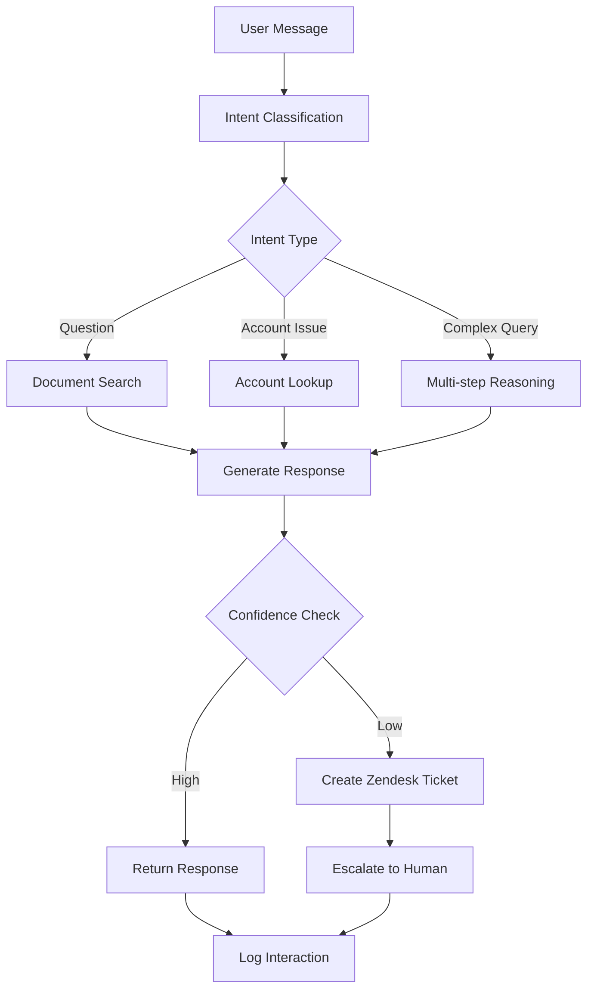

# AI Agent Fintech Chatbot - System Architecture Document

## Executive Summary

This document outlines the system architecture for an AI-powered customer support chatbot designed for a fintech company specializing in employee wage and tip distribution services. The system leverages LangChain and LangGraph frameworks to provide intelligent, context-aware responses while maintaining SOC 2 compliance and security standards.

## 1. System Overview

### 1.1 Business Context

- **Domain**: Fintech - Employee wage and tip distribution
- **Target Users**: 3,000 concurrent users
- **Primary Function**: Customer support automation with human escalation
- **Compliance**: SOC 2 Type II
- **Language**: US English only

### 1.2 Key Requirements

- **Performance**: 3-5 second response time
- **Scale**: 3,000 concurrent users
- **Knowledge Base**: 50+ PDF documents (1.5-3MB each)
- **Budget**: $40/month for AI services
- **Security**: SOC 2 compliance with audit trails
- **Integration**: Zendesk ticket creation for escalations

## 2. High-Level Architecture

### 2.1 Architecture Diagram

```
┌─────────────────────────────────────────────────────────────────┐
│                        AWS Cloud Infrastructure                 │
├─────────────────────────────────────────────────────────────────┤
│  ┌─────────────────┐  ┌─────────────────┐  ┌─────────────────┐  │
│  │   CloudFront    │  │   Route 53      │  │   WAF           │  │
│  │   (CDN)         │  │   (DNS)         │  │   (Security)    │  │
│  └─────────────────┘  └─────────────────┘  └─────────────────┘  │
├─────────────────────────────────────────────────────────────────┤
│  ┌─────────────────────────────────────────────────────────────┐│
│  │                    Application Load Balancer                ││
│  └─────────────────────────────────────────────────────────────┘│
├─────────────────────────────────────────────────────────────────┤
│  ┌─────────────────┐  ┌─────────────────┐  ┌─────────────────┐  │
│  │   ECS Cluster   │  │   ECS Cluster   │  │   ECS Cluster   │  │
│  │   (Web API)     │  │   (AI Agent)    │  │   (Admin API)   │  │
│  └─────────────────┘  └─────────────────┘  └─────────────────┘  │
├─────────────────────────────────────────────────────────────────┤
│  ┌─────────────────┐  ┌─────────────────┐  ┌─────────────────┐  │
│  │   PostgreSQL    │  │   MongoDB       │  │   Redis         │  │
│  │   (RDS)         │  │   (DocumentDB)  │  │   (ElastiCache) │  │
│  └─────────────────┘  └─────────────────┘  └─────────────────┘  │
├─────────────────────────────────────────────────────────────────┤
│  ┌─────────────────┐  ┌─────────────────┐  ┌─────────────────┐  │
│  │   S3 Bucket     │  │   SQS           │  │   CloudWatch    │  │
│  │   (Documents)   │  │   (Queues)      │  │   (Monitoring)  │  │
│  └─────────────────┘  └─────────────────┘  └─────────────────┘  │
└─────────────────────────────────────────────────────────────────┘
```

### 2.2 Core Components

1. **Web Application Layer**: FastAPI-based REST API
2. **AI Agent Layer**: LangChain/LangGraph-powered intelligent agent
3. **Knowledge Management**: Document processing and vector storage
4. **Data Layer**: PostgreSQL + MongoDB + Redis
5. **Integration Layer**: Zendesk API integration
6. **Security Layer**: Authentication, authorization, and audit logging

## 3. Detailed Component Architecture

### 3.1 Web Application Layer

#### 3.1.1 FastAPI Application Structure

```
app/
├── api/
│   ├── v1/
│   │   ├── endpoints/
│   │   │   ├── chat.py              # Chat endpoints
│   │   │   ├── admin.py             # Admin endpoints
│   │   │   ├── documents.py         # Document management
│   │   │   ├── analytics.py         # Analytics endpoints
│   │   │   └── auth.py              # Authentication
│   │   └── router.py
│   └── deps.py
├── core/
│   ├── config.py                    # Configuration management
│   ├── security.py                  # Security utilities
│   └── logging.py                   # Logging configuration
├── services/
│   ├── chat_service.py              # Chat business logic
│   ├── document_service.py          # Document processing
│   ├── ai_agent_service.py          # AI agent orchestration
│   ├── zendesk_service.py           # Zendesk integration
│   └── analytics_service.py         # Analytics processing
├── models/
│   ├── chat.py                      # Chat models
│   ├── document.py                  # Document models
│   ├── conversation.py              # Conversation models
│   └── audit.py                     # Audit trail models
└── agents/
    ├── langchain_agent.py           # LangChain agent implementation
    ├── langgraph_workflow.py        # LangGraph workflow
    └── prompt_templates.py           # Prompt templates
```

#### 3.1.2 API Endpoints

**Public Endpoints:**

- `POST /api/v1/chat/message` - Send chat message
- `GET /api/v1/chat/history/{conversation_id}` - Get conversation history
- `POST /api/v1/chat/upload` - Upload voice/file attachments

**Admin Endpoints:**

- `GET /api/v1/admin/conversations` - List all conversations
- `GET /api/v1/admin/analytics` - Get analytics data
- `POST /api/v1/admin/documents` - Upload new documents
- `GET /api/v1/admin/audit-logs` - Get audit logs

### 3.2 AI Agent Layer

#### 3.2.1 LangChain Agent Architecture

```python
# Simplified agent structure
class FintechChatAgent:
    def __init__(self):
        self.llm = ChatOpenAI(model="gpt-3.5-turbo", temperature=0.1)
        self.vectorstore = ChromaDB()  # Vector database
        self.memory = ConversationBufferWindowMemory(k=10)
        self.tools = [
            DocumentSearchTool(),
            ZendeskTicketTool(),
            AccountLookupTool()
        ]

    async def process_message(self, message: str, user_id: str) -> str:
        # Agent workflow using LangGraph
        pass
```

#### 3.2.2 LangGraph Workflow



### 3.3 Knowledge Management System

#### 3.3.1 Document Processing Pipeline

```python
class DocumentProcessor:
    def __init__(self):
        self.pdf_parser = PyPDF2Parser()
        self.text_splitter = RecursiveCharacterTextSplitter(
            chunk_size=1000,
            chunk_overlap=200
        )
        self.embeddings = OpenAIEmbeddings()
        self.vectorstore = ChromaDB()

    async def process_document(self, pdf_file: bytes) -> DocumentMetadata:
        # 1. Extract text from PDF
        text = await self.pdf_parser.extract_text(pdf_file)

        # 2. Split into semantic chunks
        chunks = self.text_splitter.split_text(text)

        # 3. Generate embeddings
        embeddings = await self.embeddings.aembed_documents(chunks)

        # 4. Store in vector database
        await self.vectorstore.add_documents(chunks, embeddings)

        # 5. Store metadata in PostgreSQL
        return await self.store_metadata(pdf_file, chunks)
```

#### 3.3.2 Semantic Chunking Strategy

**Chunking Approach:**

1. **Question-Answer Pairs**: Extract Q&A pairs as individual chunks
2. **Semantic Boundaries**: Split at logical boundaries (sections, paragraphs)
3. **Context Preservation**: Maintain context with overlapping chunks
4. **Metadata Enrichment**: Add document type, section, and relevance tags

**Vector Storage:**

- **Primary**: ChromaDB for fast similarity search
- **Backup**: MongoDB for document metadata
- **Indexing**: HNSW index for sub-second retrieval

### 3.4 Data Architecture

#### 3.4.1 Database Design

**PostgreSQL (Primary Database):**

```sql
-- Users and Authentication
CREATE TABLE users (
    id UUID PRIMARY KEY,
    email VARCHAR(255) UNIQUE NOT NULL,
    username VARCHAR(50) UNIQUE NOT NULL,
    encrypted_password VARCHAR(255) NOT NULL,
    full_name VARCHAR(100),
    is_active BOOLEAN DEFAULT TRUE,
    created_at TIMESTAMP DEFAULT NOW(),
    updated_at TIMESTAMP DEFAULT NOW()
);

-- Conversations
CREATE TABLE conversations (
    id UUID PRIMARY KEY,
    user_id UUID REFERENCES users(id),
    session_id VARCHAR(255),
    status VARCHAR(50) DEFAULT 'active',
    created_at TIMESTAMP DEFAULT NOW(),
    updated_at TIMESTAMP DEFAULT NOW()
);

-- Messages
CREATE TABLE messages (
    id UUID PRIMARY KEY,
    conversation_id UUID REFERENCES conversations(id),
    user_message TEXT,
    bot_response TEXT,
    confidence_score DECIMAL(3,2),
    response_time_ms INTEGER,
    created_at TIMESTAMP DEFAULT NOW()
);

-- Document Management
CREATE TABLE documents (
    id UUID PRIMARY KEY,
    filename VARCHAR(255) NOT NULL,
    file_path VARCHAR(500) NOT NULL,
    file_size BIGINT,
    version INTEGER DEFAULT 1,
    status VARCHAR(50) DEFAULT 'active',
    uploaded_by UUID REFERENCES users(id),
    created_at TIMESTAMP DEFAULT NOW()
);

-- Audit Trail
CREATE TABLE audit_logs (
    id UUID PRIMARY KEY,
    user_id UUID REFERENCES users(id),
    action VARCHAR(100) NOT NULL,
    resource_type VARCHAR(50),
    resource_id UUID,
    details JSONB,
    ip_address INET,
    user_agent TEXT,
    created_at TIMESTAMP DEFAULT NOW()
);
```

**MongoDB (Document Store):**

```javascript
// Document chunks with embeddings
{
  _id: ObjectId,
  document_id: UUID,
  chunk_index: Number,
  content: String,
  metadata: {
    section: String,
    document_type: String,
    version: Number
  },
  embedding: [Number], // Vector embedding
  created_at: Date
}

// Analytics data
{
  _id: ObjectId,
  date: Date,
  metrics: {
    total_conversations: Number,
    resolved_queries: Number,
    escalated_tickets: Number,
    average_response_time: Number,
    user_satisfaction_score: Number
  }
}
```

#### 3.4.2 Redis Caching Strategy

**Cache Keys:**

- `user:session:{session_id}` - User session data
- `conversation:{conversation_id}` - Active conversation context
- `document:embeddings:{doc_id}` - Cached document embeddings
- `rate_limit:{user_id}` - Rate limiting counters

## 4. Security Architecture

### 4.1 Authentication & Authorization

**JWT Token Structure:**

```json
{
  "sub": "user_id",
  "email": "user@example.com",
  "role": "customer|admin",
  "permissions": ["read", "write"],
  "exp": 1640995200,
  "iat": 1640908800
}
```

**Role-Based Access Control:**

- **Customer**: Chat access, own conversation history
- **Admin**: Full system access, analytics, document management
- **System**: Internal service-to-service communication

### 4.2 Data Encryption

**Encryption at Rest:**

- **Database**: AWS RDS encryption with KMS
- **S3**: Server-side encryption (SSE-S3)
- **Application**: Field-level encryption for PII

**Encryption in Transit:**

- **HTTPS**: TLS 1.3 for all API communications
- **Database**: SSL/TLS for database connections
- **Internal**: mTLS for service-to-service communication

### 4.3 SOC 2 Compliance

**Security Controls:**

1. **Access Controls**: Multi-factor authentication for admins
2. **Audit Logging**: Comprehensive audit trail for all actions
3. **Data Protection**: Encryption and access controls
4. **Incident Response**: Automated alerting and response procedures
5. **Vulnerability Management**: Regular security scanning

**Audit Trail Requirements:**

- All user interactions logged with timestamps
- Document access and modifications tracked
- Admin actions with full context
- Failed authentication attempts logged
- Data export/import activities recorded

## 5. Integration Architecture

### 5.1 Zendesk Integration

**Integration Flow:**

```python
class ZendeskService:
    def __init__(self):
        self.client = ZendeskAPI(
            subdomain=settings.zendesk_subdomain,
            email=settings.zendesk_email,
            token=settings.zendesk_token
        )

    async def create_ticket(self, conversation_id: str,
                           user_message: str,
                           bot_response: str) -> str:
        ticket_data = {
            "subject": f"AI Agent Escalation - Conversation {conversation_id}",
            "description": f"""
            User Query: {user_message}
            Bot Response: {bot_response}
            Confidence Score: Low
            Escalation Reason: Insufficient knowledge base match
            """,
            "requester": {"email": self.get_user_email(conversation_id)},
            "tags": ["ai-escalation", "fintech-support"]
        }

        ticket = await self.client.tickets.create(ticket_data)
        return ticket.id
```

### 5.2 External API Integrations

**Rate Limiting:**

- OpenAI API: 3,500 requests/minute
- Zendesk API: 700 requests/minute
- Internal APIs: 1,000 requests/minute per user

**Error Handling:**

- Exponential backoff for API failures
- Circuit breaker pattern for external services
- Graceful degradation when services are unavailable

## 6. Performance Optimization

### 6.1 Response Time Optimization

**Caching Strategy:**

- **L1 Cache**: In-memory cache for frequent queries (Redis)
- **L2 Cache**: Database query result caching
- **CDN**: Static content delivery via CloudFront

**Database Optimization:**

- **Indexes**: Optimized indexes for common queries
- **Connection Pooling**: PgBouncer for PostgreSQL
- **Read Replicas**: Read-only replicas for analytics queries

### 6.2 Scalability Considerations

**Horizontal Scaling:**

- **ECS Auto Scaling**: Scale based on CPU/memory usage
- **Database Scaling**: Read replicas and connection pooling
- **Queue Processing**: SQS for background tasks

**Load Balancing:**

- **Application Load Balancer**: Distribute traffic across ECS tasks
- **Health Checks**: Automated health monitoring
- **Blue-Green Deployment**: Zero-downtime deployments

## 7. Monitoring and Observability

### 7.1 Metrics and KPIs

**Business Metrics:**

- Response accuracy rate (target: >85%)
- Customer satisfaction score (target: >4.0/5.0)
- Resolution rate (target: >70%)
- Average response time (target: <4 seconds)

**Technical Metrics:**

- API response times
- Database query performance
- AI model inference times
- Error rates and availability

### 7.2 Logging Strategy

**Log Levels:**

- **ERROR**: System errors, failed operations
- **WARN**: Performance issues, degraded functionality
- **INFO**: User actions, business events
- **DEBUG**: Detailed execution traces

**Log Aggregation:**

- **CloudWatch Logs**: Centralized logging
- **Structured Logging**: JSON format for easy parsing
- **Log Retention**: 90 days for compliance

## 8. Deployment Architecture

### 8.1 AWS Infrastructure

**ECS Cluster Configuration:**

```yaml
# ECS Task Definition
apiVersion: v1
kind: Service
metadata:
  name: FastAPI-ai-api
spec:
  replicas: 3
  selector:
    app: FastAPI-ai-api
  template:
    spec:
      containers:
        - name: api
          image: FastAPI-ai-api:latest
          ports:
            - containerPort: 8000
          env:
            - name: DATABASE_URL
              valueFrom:
                secretKeyRef:
                  name: db-secret
                  key: url
          resources:
            requests:
              memory: "512Mi"
              cpu: "250m"
            limits:
              memory: "1Gi"
              cpu: "500m"
```

**Infrastructure Components:**

- **ECS Fargate**: Serverless container hosting
- **RDS PostgreSQL**: Managed database service
- **DocumentDB**: MongoDB-compatible document database
- **ElastiCache Redis**: Managed Redis service
- **S3**: Document storage and static assets
- **CloudFront**: CDN for static content

### 8.2 CI/CD Pipeline

**Deployment Pipeline:**

1. **Code Commit**: Trigger build pipeline
2. **Testing**: Unit tests, integration tests, security scans
3. **Build**: Docker image creation and registry push
4. **Deploy**: Blue-green deployment to ECS
5. **Health Check**: Automated health verification
6. **Rollback**: Automatic rollback on failure

## 9. Cost Optimization

### 9.1 Monthly Budget Breakdown ($40)

**AI Services (OpenAI):**

- GPT-3.5-turbo: ~$20/month (estimated 10,000 requests)
- Embeddings: ~$5/month (document processing)
- **Total AI**: ~$25/month

**AWS Infrastructure:**

- ECS Fargate: ~$8/month (3 tasks, 0.5 vCPU each)
- RDS PostgreSQL: ~$5/month (db.t3.micro)
- DocumentDB: ~$2/month (minimal usage)
- **Total AWS**: ~$15/month

### 9.2 Cost Optimization Strategies

1. **AI Model Selection**: Use GPT-3.5-turbo for cost efficiency
2. **Caching**: Reduce API calls through intelligent caching
3. **Batch Processing**: Process documents in batches
4. **Resource Right-sizing**: Monitor and adjust resource allocation
5. **Reserved Instances**: Consider reserved instances for predictable workloads

## 10. Risk Assessment and Mitigation

### 10.1 Technical Risks

**Risk**: AI Model API failures
**Mitigation**: Circuit breaker pattern, fallback responses, multiple model providers

**Risk**: Database performance degradation
**Mitigation**: Connection pooling, read replicas, query optimization

**Risk**: High latency during peak usage
**Mitigation**: Auto-scaling, caching, CDN implementation

### 10.2 Business Risks

**Risk**: Inaccurate AI responses
**Mitigation**: Confidence scoring, human escalation, continuous model improvement

**Risk**: Data privacy breaches
**Mitigation**: Encryption, access controls, audit logging, SOC 2 compliance

**Risk**: Service downtime
**Mitigation**: High availability architecture, automated failover, monitoring

## 11. Implementation Roadmap

### Phase 1: Foundation (Weeks 1-2)

- Set up AWS infrastructure
- Implement basic FastAPI endpoints
- Configure databases and authentication
- Deploy initial application

### Phase 2: AI Agent Core (Weeks 3-4)

- Implement LangChain agent
- Set up document processing pipeline
- Create vector database and embeddings
- Basic chat functionality

### Phase 3: Integration & Security (Weeks 5-6)

- Zendesk integration
- Security implementation
- Audit logging
- SOC 2 compliance measures

### Phase 4: Advanced Features (Weeks 7-8)

- Voice message support
- File upload functionality
- Analytics dashboard
- Performance optimization

### Phase 5: Testing & Deployment (Weeks 9-10)

- Comprehensive testing
- Performance tuning
- Security audit
- Production deployment

## 12. Success Criteria

### 12.1 Technical Success Metrics

- Response time < 4 seconds (95th percentile)
- System availability > 99.5%
- AI response accuracy > 85%
- Zero security incidents

### 12.2 Business Success Metrics

- Customer satisfaction score > 4.0/5.0
- Resolution rate > 70%
- Reduction in human support tickets by 40%
- Monthly operational cost < $40

## Conclusion

This architecture provides a robust, scalable, and secure foundation for your AI-powered fintech chatbot. The design leverages your existing FastAPI infrastructure while incorporating advanced AI capabilities through LangChain and LangGraph. The system is designed to meet SOC 2 compliance requirements while staying within your budget constraints.

The modular architecture allows for incremental implementation and future enhancements, ensuring the system can evolve with your business needs. The comprehensive monitoring and analytics capabilities will provide valuable insights for continuous improvement of the AI agent's performance.
